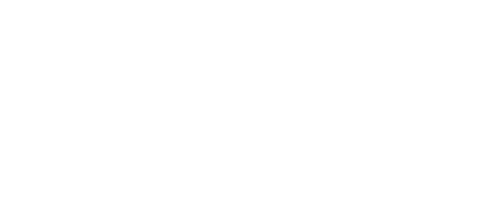
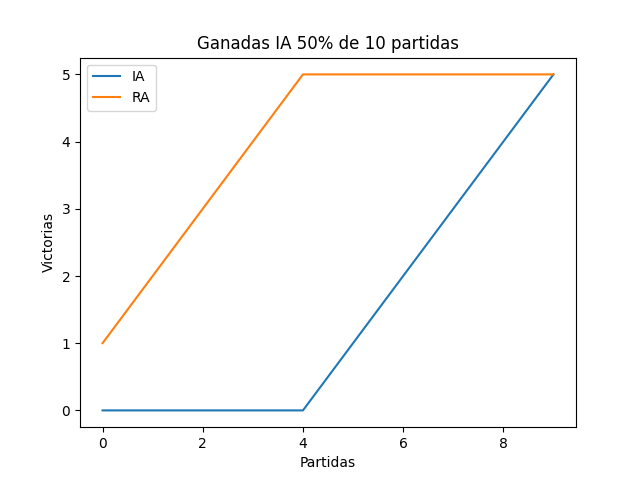
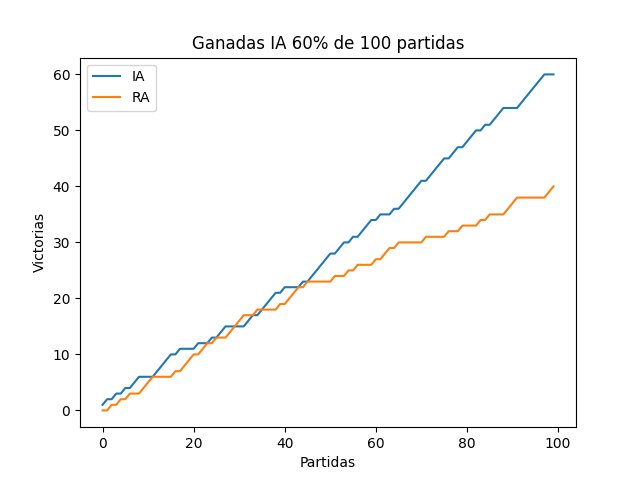
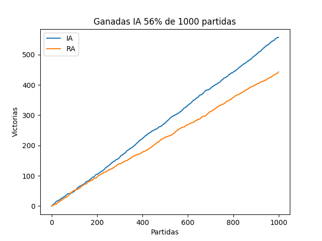
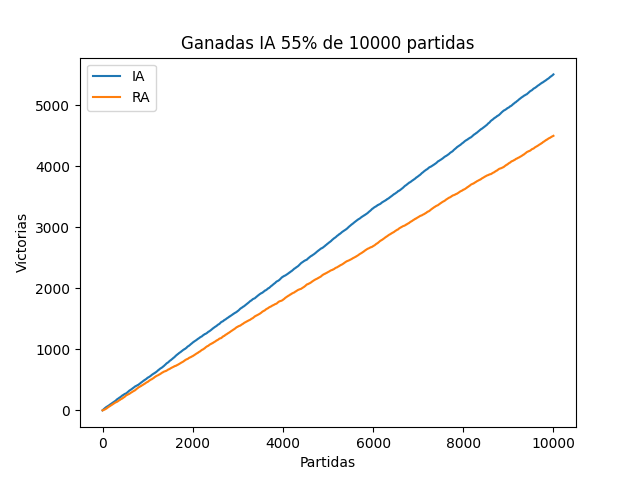

# Hundir la flota (IA🤖)

Este proyecto se enfoca en la creación de un [Hundir la flota](https://es.wikipedia.org/wiki/Batalla_naval_(juego)), que sea capaz de jugar de manera automática con la característica de que el disparo (las coordenadas donde el jugador cree que está el barco enemigo) sean predichas por una [red neuronal](https://en.wikipedia.org/wiki/Feedforward_neural_network).

## Problema

Obviando la creación del juego base, tenemos el siguiente problema:
Necesitamos crear una red neuronal que decida donde deberíamos disparar con base a una entrada. De ahí sacamos que necesitamos encontrar:

1. El input para nuestra red
2. Las capas ocultas que tendrá la red
3. La forma de la capa de salida (output)

De esta última será de donde saquemos las coordenadas predichas por la red. Teniendo en cuenta que los jugadores tendrán la siguiente información:

* Tablero aliado(TA): El tablero con sus barcos
* Tablero a desvelar(TD): El tablero con las posiciones conocidas del jugador contrario

## Solución planteada

Para afrontar el problema, la estructura de la red que he pensado es esta:

Con esta estructura lo que hacemos es dar como input a la red el tablero TD y eso nos genera como output otro "tablero" conformado por otras 100 neuronas de las cuales elegiremos la que más se active como coordenada deseada.

Aclarar que aunque en la ilustración las capas de entra/salida tienen la forma del tablero 10x10 en realidad tanto la capa de entrada como la de salida son 100 neuronas en fila, solo las represento así para que sea más visual y que no he representado la forma de las capas ocultas en la ilustración, ya que para la generación de la red he usado el algoritmo [NEAT](https://neat-python.readthedocs.io/en/latest/neat_overview.html), lo que hace que no tenga mucho sentido dibujar la estructura oculta si de un entrenamiento a otro las capas ocultas pueden cambiar.

## Prueba de la solución

Ahora que tenemos la red para probar es hora de entrenarla, no lo he mencionado antes, pero esta red será entrenada mediante entrenamiento reforzado([Reinforcement learning](https://en.wikipedia.org/wiki/Reinforcement_learning)), lo que haremos será ponerla a jugar para que consiga tanto recompensas como castigos:

* Recompensa cuando acierte a un barco
* Castigo cuando dispare al agua/repita una posición ya usada.

Y así lograr que encuentre la manera más óptima para jugar a través de la experiencia del entrenamiento, aunque ya os adelanto que en un juego tan poco dinámico y limitado en acciones como este, junto a su gran componente de aleatoriedad, no se le sacara todo el partido a nuestra red.

## Resultados

Habiendo entrenado a 50 individuos en 200 generaciones, estos son los resultados:

* *IA: La red entrenada*
* *RA: Disparo aleatorio*

Con las gráficas se pueden ver los resultados que tiene nuestra red en las partidas contra el jugador aleatorio. La efectividad en pequeñas muestras es prácticamente aleatoria, pero se estabiliza a medida que se aumenta el número de muestras. Eso si, solo con una mejora de entorno al 6% frente al juego aleatorio.

Esto ocurre ya que en este juego en concreto el factor suerte/aleatorio está muy presente, haciendo que desaprovechemos la capacidad de encontrar patrones para superar al rival. Pero consigue que yo no tenga que trabajar con ``los malvados índices de un arreglo``, así que para mí esto es un 10 en toda regla😁.

## Requisitos y dependencias

Este proyecto ha sido realizado usando Python 3.10, aunque puede ser utilizado por cualquier versión que pueda soportar las siguientes librerías:

* neat-python
* pickleshare
* numpy
* matplotlib

Estas pueden ser instaladas automáticamente utilizando el comando ``pip3 install -r .\requirements.txt``.

## Uso

### Juego

* Para probar el juego solo hay que ejecutar el archivo ``hundir_la_flota_con_clases.py``. Cuando termine las n partidas (default 100) mostrara una gráfica con las victorias.
* Para jugarlo online en una misma red local, solo hay que ejecutar ``hundir_la_flota_online.py`` en 2 equipos diferentes y mediante difusión se encontraran para empezar a jugar.

### Entrenamiento

* Podremos entrenar la red mediante el archivo ``entrenador.ipynb`` que es un jupyter Notebook. Este archivo carga la configuración de entrenamiento del ``config-feedforward.txt`` y pone a jugar a los diferentes individuos(redes neuronales) para que desarrollen las mejores tácticas que encuentren. Una vez finalizado el entrenamiento se genera un archivo [.plk](https://docs.python.org/3/library/pickle.html) con la red que mejor resultados ha dado (el nombre del arvhivo predeterminado es ``red_entrenada.plk``).
* **Adicionalmente, podemos cambiar los parámetros de entrenamiento** de nuestra red tales como: la función de activación([ReLu](https://en.wikipedia.org/wiki/Activation_function)), el número de individuos de cada población o el número de capas ocultas, junto a otras muchas más cosas en el archivo ``config-feedforward.txt`` DOC del [config](https://neat-python.readthedocs.io/en/latest/config_file.html#neat-sectionhttps:/).

## Referencias y agradecimientos

Muchísimas gracias a todos los creadores de contenido que publicaron sus conocimientos para que cualquiera pudiera aprenderlos e implementarlos.

* Conocimiento general de IA [Dot CSV](https://www.youtube.com/@DotCSV)
* Algoritmo usado en el proyecto [NEAT](https://nn.cs.utexas.edu/downloads/papers/stanley.cec02.pdf)

* Implementación del algoritmo NEAT [Tech With Tim](https://www.youtube.com/watch?v=wQWWzBHUJWM&list=PLzMcBGfZo4-lwGZWXz5Qgta_YNX3_vLS2&index=6)
* Comprensión de las matemáticas [3Blue1Brown](https://www.youtube.com/@3blue1brown), [StatQuest with Josh Starmer](https://www.youtube.com/@statquest)
